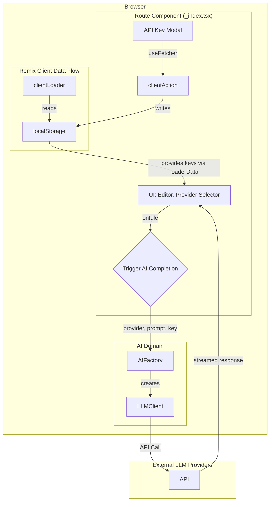

# System Patterns

## System Architecture

### High-Level Architecture

The application uses a "Bring Your Own Key" (BYOK) model, where the client communicates directly with third-party LLM providers. All user data and API keys remain in the browser, ensuring privacy. Remix's `clientLoader` and `clientAction` are used to manage API keys stored in `localStorage`.



### Domain-Driven Design Structure

The DDD structure is organized to support multiple AI providers with a common interface.

```
app/
├── domains/
│   └── ai/
│       ├── models.ts           # Common types (LLMClient, LLMProvider)
│       ├── factories.ts        # Dynamically creates the correct client
│       ├── openai-client.ts    # OpenAI-specific implementation
│       ├── claude-client.ts    # Anthropic-specific implementation
│       └── gemini-client.ts    # Google-specific implementation
├── routes/
│   └── _index.tsx             # Main page, clientLoader/Action, UI
└── components/
    ├── ApiKeyModal.tsx
    ├── QuillEditor.client.tsx
    └── SimpleQuestionDisplay.tsx
```

## Key Technical Decisions

### 1. Editor Technology Choice
- **Selected**: Quill
- **Rationale**: 
  - Rich WYSIWYG capabilities with a clean "bubble" theme.
  - Good React integration and simpler implementation for current needs.

### 2. Input Monitoring Strategy
- **Selected**: Debounced input monitoring with 5-second delay
- **Implementation**: `useEffect` + `setTimeout` in the main route component.
- **Rationale**: 
  - Prevents excessive AI processing.
  - Balances responsiveness with performance.

### 3. LLM Integration Approach
- **Selected**: Multi-Provider "Bring Your Own Key" (BYOK).
- **Rationale**: 
  - **Privacy**: No user prompt data is sent to our servers.
  - **Model Quality**: Allows users to access high-quality models like GPT-4, Claude 3, and Gemini.
  - **Flexibility**: Users can choose their preferred provider.
  - **Cost**: Avoids server-side infrastructure costs for the application owner.
- **Decision Records**: See [ADR-0003](./../docs/adr/0003-use-byok-for-llm-integration.md) and [ADR-0004](./../docs/adr/0004-multi-provider-byok-llm-integration.md).

### 4. API Key Management
- **Selected**: Remix `clientLoader` and `clientAction` with `localStorage`.
- **Rationale**:
    - Aligns with the framework's data loading and mutation patterns.
    - `clientLoader` provides a clean, server-render-safe way to load client-only data.
    - `clientAction` handles data mutations securely on the client.
    - Using `useFetcher` for the API key modal prevents full-page navigations, providing a smoother UX.

### 5. State Management
- **Selected**: Centralized in the main route (`_index.tsx`), managed by Remix loaders.
- **Rationale**: 
  - Creates a clear, unidirectional data flow.
  - Simplifies state synchronization.
  - Sufficient for the current application complexity.

## Design Patterns

### 1. Container/Presentational Pattern
- `_index.tsx` acts as a **Container** component, managing all state and logic.
- `SimpleQuestionDisplay.tsx` is a **Presentational** component, rendering data passed via props.

### 2. Factory Pattern
- The `AIFactory` is used to dynamically instantiate the correct provider-specific LLM client based on user selection.

### 3. Client-Side Data Flow (Remix)
- `clientLoader` is used to load data from `localStorage` into the route component.
- `clientAction` and `useFetcher` are used to mutate `localStorage` data without triggering a full navigation.

## Component Relationships

### _index.tsx (Container)
```
_index.tsx (Route)
├── loaderData: apiKeys, provider
├── Actions: saveApiKey
├── Handlers: onContentChange, onIdle, onProviderChange
└── Children: QuillEditor, SimpleQuestionDisplay, ApiKeyModal
```

### QuillEditor.client.tsx
```
QuillEditor.client.tsx
├── Props: onContentChange, onIdle
├── State: Internal editor state
└── Events: Manages editor events and calls back to parent on change/idle
```

### SimpleQuestionDisplay.tsx (Presentational)
```
SimpleQuestionDisplay.tsx
├── Props: question, modelLoading, isGenerating, error
├── State: none (stateless)
└── Renders the UI based entirely on the props it receives.
```

### ApiKeyModal.tsx
```
ApiKeyModal.tsx
├── Props: isOpen, onClose, provider
├── Fetcher: Manages form submission state to the clientAction
└── Renders a form to input an API key for a specific provider.
```

## Data Flow

### API Key Management Flow
1. **Load**: `_index.clientLoader` reads keys from `localStorage`.
2. **Render**: `_index.tsx` receives keys via the `loaderData` prop.
3. **Submit**: User enters key in `ApiKeyModal` and submits the `<fetcher.Form>`.
4. **Mutate**: The `_index.clientAction` receives the form data and writes the key to `localStorage`.
5. **Revalidate**: The loader is automatically revalidated, and the UI updates with the new key state.

### AI Question Generation Flow
1. **Input**: User types in `QuillEditor`.
2. **Idle**: `onIdle` trigger fires in `_index.tsx`.
3. **Factory**: `AIFactory` is called with the selected provider.
4. **Client**: The appropriate `LLMClient` is created.
5. **API Call**: The client calls the external provider's API with the prompt and key.
6. **Display**: The streamed response is rendered in `SimpleQuestionDisplay`.
