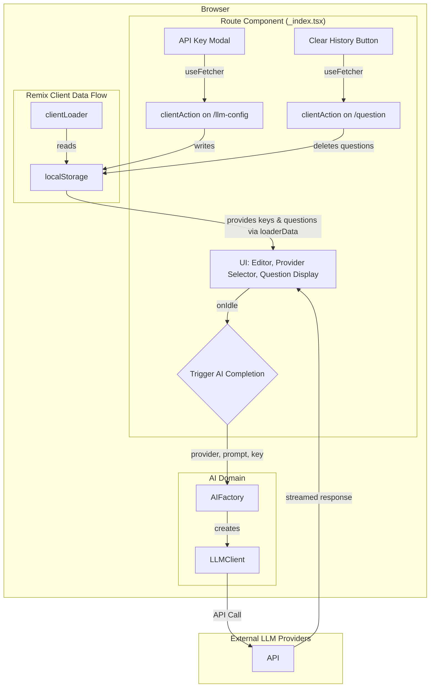

# System Patterns

## System Architecture

### High-Level Architecture

The application uses a "Bring Your Own Key" (BYOK) model, where the client communicates directly with third-party LLM providers. All user data and API keys remain in the browser, ensuring privacy. Remix's `clientLoader` and `clientAction` are used to manage API keys and user data stored in `localStorage`.



### Domain-Driven Design Structure

The DDD structure is organized to support multiple AI providers with a common interface.

```
app/
├── domains/
│   └── ai/
│       ├── models.ts           # Common types (LLMClient, LLMProvider)
│       ├── factories.ts        # Dynamically creates the correct client
│       ├── openai-client.ts    # OpenAI-specific implementation
│       ├── claude-client.ts    # Anthropic-specific implementation
│       └── gemini-client.ts    # Google-specific implementation
├── routes/
│   ├── _index.tsx             # Main page, clientLoader/Action, UI
│   ├── llm-config.tsx         # Handles LLM configuration actions
│   └── question.tsx           # Handles question generation and deletion
└── components/
    ├── LlmConfigurer.tsx
    ├── QuillEditor.client.tsx
```

## Key Technical Decisions

### 1. Editor Technology Choice
- **Selected**: Quill
- **Rationale**: 
  - Rich WYSIWYG capabilities with a clean "bubble" theme.
  - Good React integration and simpler implementation for current needs.

### 2. Input Monitoring Strategy
- **Selected**: Debounced input monitoring with 3-second delay
- **Implementation**: `onIdle` prop on `QuillEditor` component.
- **Rationale**: 
  - Prevents excessive AI processing.
  - Balances responsiveness with performance.

### 3. LLM Integration Approach
- **Selected**: Multi-Provider "Bring Your Own Key" (BYOK).
- **Rationale**: 
  - **Privacy**: No user prompt data is sent to our servers.
  - **Model Quality**: Allows users to access high-quality models like GPT-4, Claude 3, and Gemini.
  - **Flexibility**: Users can choose their preferred provider.
  - **Cost**: Avoids server-side infrastructure costs for the application owner.
- **Decision Records**: See [ADR-0003](./../docs/adr/0003-use-byok-for-llm-integration.md) and [ADR-0004](./../docs/adr/0004-multi-provider-byok-llm-integration.md).

### 4. API Key and Question Management
- **Selected**: Remix `clientLoader` and `clientAction` with `localStorage`.
- **Rationale**:
    - Aligns with the framework's data loading and mutation patterns.
    - `clientLoader` provides a clean, server-render-safe way to load client-only data.
    - `clientAction` handles data mutations securely on the client.
    - Using `useFetcher` for forms prevents full-page navigations, providing a smoother UX.

### 5. State Management
- **Selected**: Centralized in the main route (`_index.tsx`), managed by Remix loaders and actions.
- **Rationale**: 
  - Creates a clear, unidirectional data flow.
  - Simplifies state synchronization.
  - Sufficient for the current application complexity.

## Design Patterns

### 1. Resource Routes
- The application uses resource routes like `/question` and `/llm-config` to handle specific server-side logic without rendering a UI. This keeps the main route focused on presentation and state management.

### 2. Factory Pattern
- The `AIFactory` is used to dynamically instantiate the correct provider-specific LLM client based on user selection.

### 3. Client-Side Data Flow (Remix)
- `clientLoader` is used to load data from `localStorage` into the route component.
- `clientAction` and `useFetcher` are used to mutate `localStorage` data without triggering a full navigation.

## Component Relationships

### _index.tsx (Container)
```
_index.tsx (Route)
├── loaderData: llmConfig, content, questions
├── Fetchers: questionFetcher, contentFetcher
├── Renders: QuillEditor, LlmConfigurer
└── Displays: Generated questions, loading states
```

### QuillEditor.client.tsx
```
QuillEditor.client.tsx
├── Props: content, onContentChange, onIdle
├── State: Internal editor state
└── Events: Manages editor events and calls back to parent on change/idle
```

### LlmConfigurer.tsx
```
LlmConfigurer.tsx
├── Props: llmConfig
├── Fetcher: Manages form submission to the `/llm-config` clientAction
└── Renders a form to configure LLM provider and API key.
```

## Data Flow

### API Key Management Flow
1. **Load**: `_index.clientLoader` reads `llmConfig` from `localStorage`.
2. **Render**: `_index.tsx` receives `llmConfig` via the `loaderData` prop and passes it to `LlmConfigurer`.
3. **Submit**: User modifies settings in `LlmConfigurer` and submits the `<fetcher.Form>`.
4. **Mutate**: The `llm-config.clientAction` receives the form data and writes the config to `localStorage`.
5. **Revalidate**: The loader is automatically revalidated, and the UI updates with the new state.

### AI Question Generation Flow
1. **Input**: User types in `QuillEditor`.
2. **Idle**: `onIdle` trigger fires in `_index.tsx`.
3. **Submit**: `questionFetcher` submits the content to the `/question` route via `POST`.
4. **Action**: The `question.clientAction` calls the `AIFactory` to get the appropriate `LLMClient`.
5. **API Call**: The client calls the external provider's API.
6. **Store**: The new question is added to the list in `localStorage`.
7. **Return**: The action returns the updated question list.
8. **Display**: The `_index.tsx` component re-renders with the new questions from `questionFetcher.data`.

### Clear Question History Flow
1. **Click**: User clicks the "Clear History" button in `_index.tsx`.
2. **Submit**: `questionFetcher` submits a `DELETE` request to the `/question` route.
3. **Action**: The `question.clientAction` detects the `DELETE` method and removes `previousQuestions` from `localStorage`.
4. **Return**: The action returns an empty array of questions.
5. **Display**: The `_index.tsx` component re-renders, and the question list is now empty.
